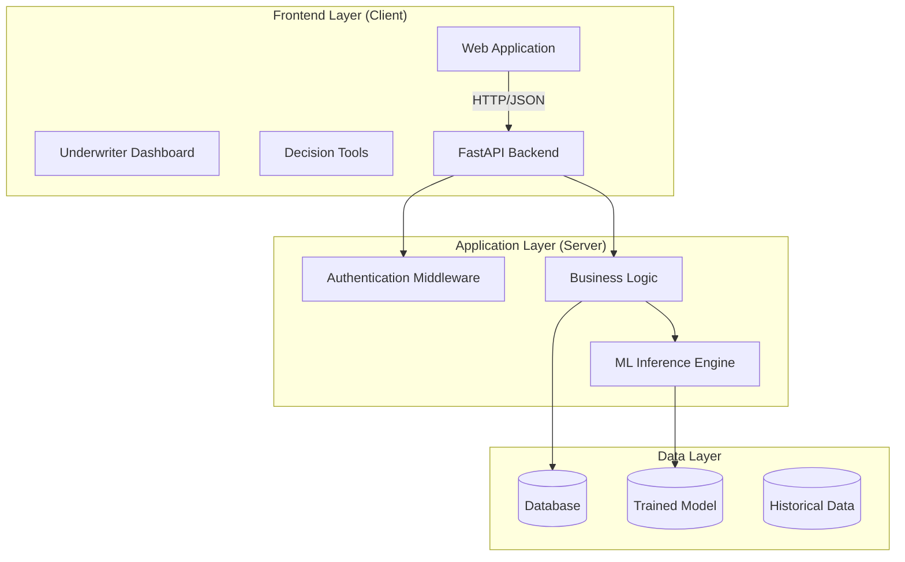

# System Architecture

## Overview
The AI-Driven Smart Credit Evaluation System follows a modern 3-tier architecture, separating the presentation layer, application logic, and data layer. The system is designed for scalability, maintainability, and ease of deployment.

## Architecture Diagram

## Component Description

### 1. Frontend Layer
- **Technology**: HTML5, CSS3, JavaScript (Vanilla)
- **Framework**: Custom lightweight framework with Apple-inspired design system
- **Components**:
  - **Applicant Portal**: Form submission, document upload
  - **Decision Tools**: Loan comparison, EMI calculator, Benchmarking
  - **Underwriter Dashboard**: Risk analytical view, batch processing

### 2. Application Layer (Backend)
- **Technology**: Python 3.9+
- **Framework**: FastAPI (High-performance async framwork)
- **Key Modules**:
  - `main.py`: API entry point and route handling
  - `model.py`: ML model wrapping and prediction logic
  - `document_parser.py`: Document analysis logic
  - `generate_dataset.py`: Synthetic data generation utility

### 3. Data Layer
- **Database**: SQLite (Development) / PostgreSQL (Production)
- **Data Storage**:
  - `business_credit_data.csv`: Historical training data
  - `model.pkl`: Serialized Random Forest model
  - `scaler.pkl`: Feature scaler for normalization

## Data Flow

1. **Application Submission**:
   User submits data via Frontend Form -> API `POST /predict` -> ML Engine -> Risk Score -> Frontend Response

2. **Document Analysis**:
   User uploads PDF -> API `POST /analyze-document` -> Parser extracts text -> ML Logic evaluates strength -> JSON Response

3. **Model Training**:
   `train_model.py` reads CSV -> Preprocessing -> Model Training -> Save `.pkl` files
